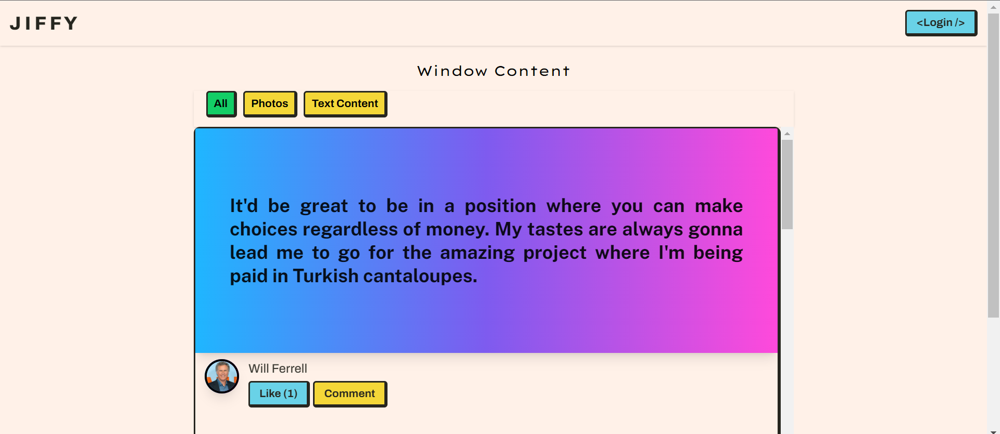
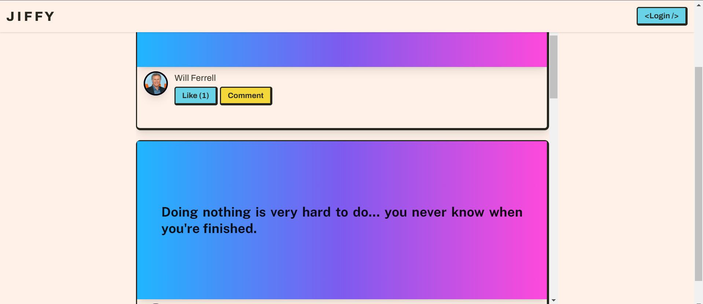
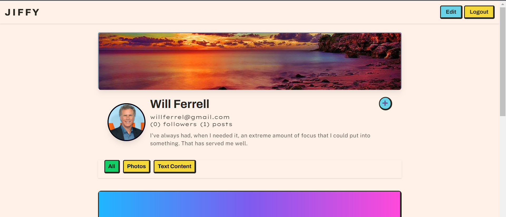
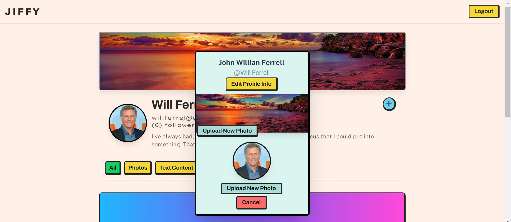
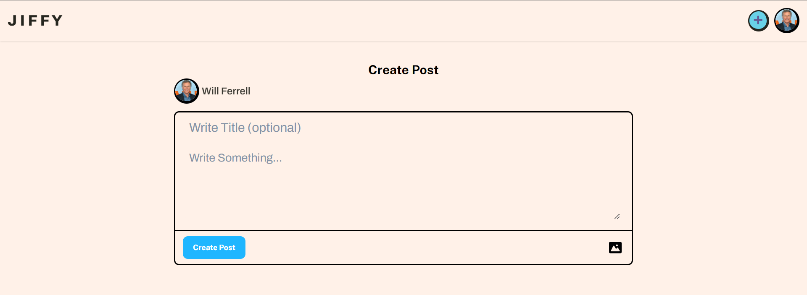
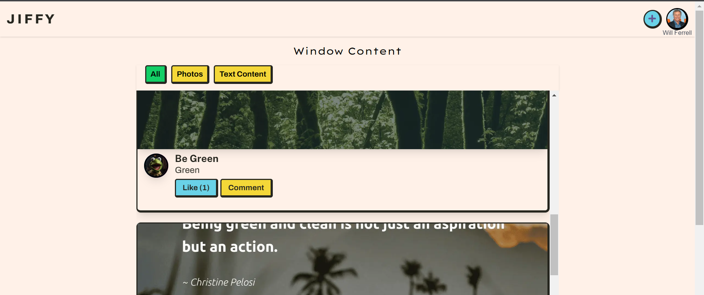

# J I F F Y 

A social media app based on Facebook and Instagram with a style from YouTube. TailwindCSS and React.js handle the frontend, and Firebase handles the backend.

## Demo

https://jiffyview.netlify.app/

## Screenshots

## Author

- [@JulesMoreno(Huls26)](https://github.com/Huls26)

## Tech Stack

**Client:** React, TailwindCSS

**Database/Backend:** Firebase

